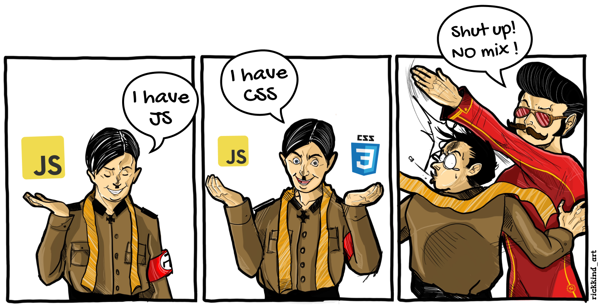

<div align="center">
  
</div>
<br/>
<br/>
<br/>
<br/>

# Stylin
Stylin is a build-time CSS library that offers an elegant way to style React components. It extends CSS Modules and adds some missing features like dynamic variables or auto-typing.

There is no faster way to create styled & typed React component.

```jsx
import {Title} from './styles.scss'


<Title color="tomato" size="small">
  Hello world!
</Title>
```

#### 💅 `style.scss`
```scss
/**
  @tag: h1
  @component: Title
  size: small | medium | large
  color: #38383d --color
*/
.title {
  --color: #38383d;
  color: var(--color);
  font-size: 18px;
  
  &.small {
    font-size: 14px;
    margin: 2px 0;
  }
  &.medium {
    font-size: 18px;
    margin: 4px 0;
  }
  &.large {
    font-size: 20px;
    margin: 6px 0;
  }
}
```
<br/>

#### 🧙‍♂️ `Type auto-generation`

<br/>

All the magic is behind the style annotations, which you can find in the comment section. It is like JSDoc, but for CSS. However, it is not a CSSDoc. It is more about mapping styles with component properties. 

With the annotations you can:
 - map styles with components
 - generate TypeScript types
 - generate documents or even stories for StoryBook

For all these, you will need a specific package, plugin, or webpack loader.
<br/>

## Demo
✨<br/>
✨ [Github repo](https://github.com/sultan99/cards)<br/>
✨<br/>
<br/>

## Get started
The core library:
```sh
npm install @stylin/style
npm install --save-dev @stylin/msa-loader
```

Then you should add the loader in your webpack configs files:
 - [MSA loader](./packages/msa-loader/README.md)
 - [TypeScript loader (optional)](./packages/ts-loader/README.md)
<br/>

## Diving deeper

Don't be scared to learn new stuff, it is deadly simple. Only three things to remember:
1) @tag: html tag
2) @component: name of your component
3) Mapping object:

```
componentPropertyName {
  propertyValue: css-class-name
  anotherPropertyValue: another-css
}
```

For example:
```scss
/**
  @tag: button
  @component: SexyButton
  type {
    primary: btn-primary
    secondary: bnt-secondary
    link: btn-link
  }
*/
.sexy-button {
  /* css styles */
}
```

```jsx
<SexyButton type='primary'>
  Love me
</SexyButton>

/* HTML output:
<button class="a-hashed css-name">
  Love me
</button>
*/
```

Done! That is all about to know! 🎉🥳

Now you are the PRO 😎. Update your resume with a new skill!
<br/>

## Shortening
Here are [some tips](./packages/msa-loader/README.md) to make life easier. 

If your component property values are similar to CSS class names, like in the example below:

```
type {
  primary: primary
  secondary: secondary
  link: link
}
```

It can be shorten this way:

```
type: primary | secondary | link
```

Sweet! what is next? Read more about:
 - [Shortening and variables](./packages/style/README.md)
 - [TypeScript](./packages/ts-loader/README.md)
<br/>

## Next development plans
1) Support forwardRef
2) Restyling existing components:

```jsx
import {Button} from 'antd'
import {applyStyle} from './styles.scss'

const StyledButton = applyStyle(Button)
```

3) Support library configurations to handle React-like libraries (preact etc.).
<br/>

### Glossary
**Stalin**
/stʌlɪn/ nickname. Joseph Vissarionovich Stalin was a Soviet politician who ruled the Soviet Union from the mid-1920s until his death in 1953.

**Stylin**
/stɪlɪn/ slang. Meaning looking good or in fashion.

**Stylin**
/stʌɪlɪn/ noun. Dictator of style. CSS library for styling React components.
