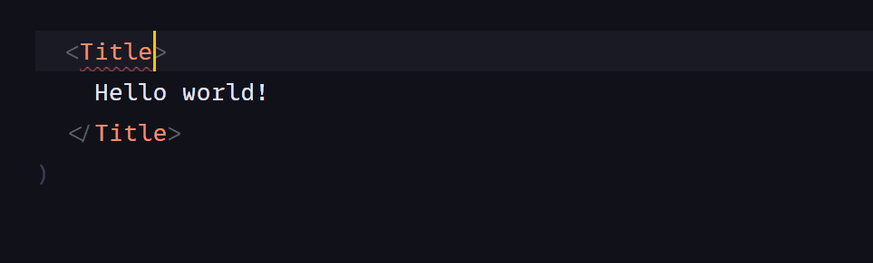

<div align="center">
  
</div>
<br/>
<br/>
<br/>
<br/>

# Stylin
Stylin is a built-time CSS library that offers an elegant way to style React components. It extends CSS Modules and adds some missing features like dynamic variables or auto-typing.

There is no faster way to create styled & typed React component.

```jsx
import {Title} from './styles.scss'


<Title color="tomato" size="large">
  Hello world!
</Title>
```

#### 💅 `style.scss`
```scss
/**
  @tag: h1
  @component: Title
  size: small | medium | large
  color: #38383d --color
*/
.title {
  --color: #38383d;
  color: var(--color);
  font-size: 18px;
  
  &.small {
    font-size: 14px;
    margin: 2px 0;
  }
  &.medium {
    font-size: 18px;
    margin: 4px 0;
  }
  &.large {
    font-size: 20px;
    margin: 6px 0;
  }
}
```

### Typing auto-generation

<br/>

All the magic is behind the style annotations, which you can find in the comment section. It is like JSDoc, but for CSS. However, it is not a CSSDoc. It is more about mapping styles with component properties. 

With the annotations you can:
 - map styles with components
 - generate TypeScript types
 - generate documents or even stories for StoryBook

For all these, you will need a specific package, plugin, or webpack loader.
<br/>
<br/>

## Diving deeper

Don't be scared to learn new stuff, it is deadly simple. Only three things to remember:
1) @tag: html tag
2) @component: name of your component
3) Mapping object: 
```scss
componentPropertyName {
  propertyValue: css-class-name
  anotherPropertyValue: another-css
}
```

For example:
```scss
/**
  @tag: button
  @component: SexyButton
  type {
    primary: btn-primary
    secondary: bnt-secondary
    link: btn-link
  }
*/
.sexy-button {
  /* css styles */
}
```

`JSX`
```jsx
<SexyButton type='primary'>
  Love me
</SexyButton>

/* HTML output:
<button class="a-hashed css-name">
  Love me
</button>
*/
```

Done! That is all about to know! 🎉🥳

Now you are the PRO 😎. Update your resume with a new skill!
<br/>
<br/>

## Shortening
Here are some tips to make life easier. 

If your component property values are similar to CSS class names, like in the example below:

```scss
type {
  primary: primary
  secondary: secondary
  link: link
}
```

It can be shorten this way:

```scss
type: primary | secondary | link
```

Sweet! what is next?

```scss
/* conditional */
isVisible {
  true: visible
  false: hidden
}
/* short version */
isVisible: true ? visible : hidden

/* by the way it can be string or number */
checked: on ? blue : gray
checked: 1 ? blue : gray

/* single value */
isVisible {
  true: visible
}
/* short version */
isVisible: true visible

/* if value == css-name */
enabled {
  true: enabled
}
/* short version */
enabled: true
```

## Variables
To map component variables with styles, you should provide the CSS variable and its default value. Webpack loader uses the default value to define the variable type and avoid reassigning it with the same value.

```scss
componentPropertyName: defualt-value --css-variable
```

```scss
/**
  @tag: button
  @component: SexyButton
  width: 150px --btn-width
*/
.sexy-button {
  --btn-width: 150px;
  width: var(--btn-width);
}
```

`JSX`
```jsx
<SexyButton width='180px'>
  Love me
</SexyButton>

/* HTML output:
<button style="--btn-width: 180px">
  Love me
</button>
*/
```

### Caveat with CSS variables
You can't interpolate CSS variables with url(), it means you can't do this:

```scss
background-image: url(var(--src)); // will not work
```

Why? Read the answer [here](https://stackoverflow.com/questions/42330075/is-there-a-way-to-interpolate-css-variables-with-url). To fix this issue, you need to wrap the value with `url()` on JS side:

```scss
/**
  @tag: div
  @component: Avatar
  url: unset --src;
*/
.avatar {
  background-image: var(--src);
}
```

`JSX`
```jsx
const src = `https://picsum.photos/150`

<Avatar url={`url(${src})`}/>
```
<br/>
<br/>

## TypeScript
For optional component properties, add a question mark as you do in typescript:

```scss
/**
  @tag: input
  @component: Input
  disabled?: true
*/
```
<br/>
<br/>

## Next development plans
1) Support forwardRef
2) Restyling existing components:

```jsx
import {Button} from 'antd'
import {applyStyle} from './styles.scss'

const StyledButton = applyStyle(Button)
```

3) Support library configurations to handle React-like libraries (preact etc.).
<br/>
<br/>

### Glossary
**Stalin**
/stʌlɪn/ nickname. Joseph Vissarionovich Stalin was a Soviet politician who ruled the Soviet Union from the mid-1920s until his death in 1953.

**Stylin**
/stɪlɪn/ slang. Meaning looking good or in fashion.

**Stylin**
/stʌɪlɪn/ noun. Dictator of style. CSS library for styling React components.
