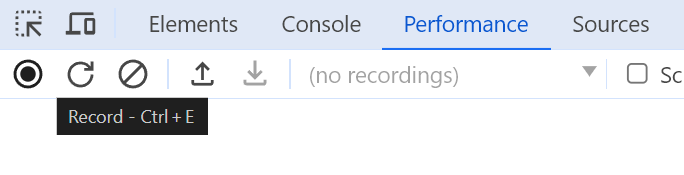
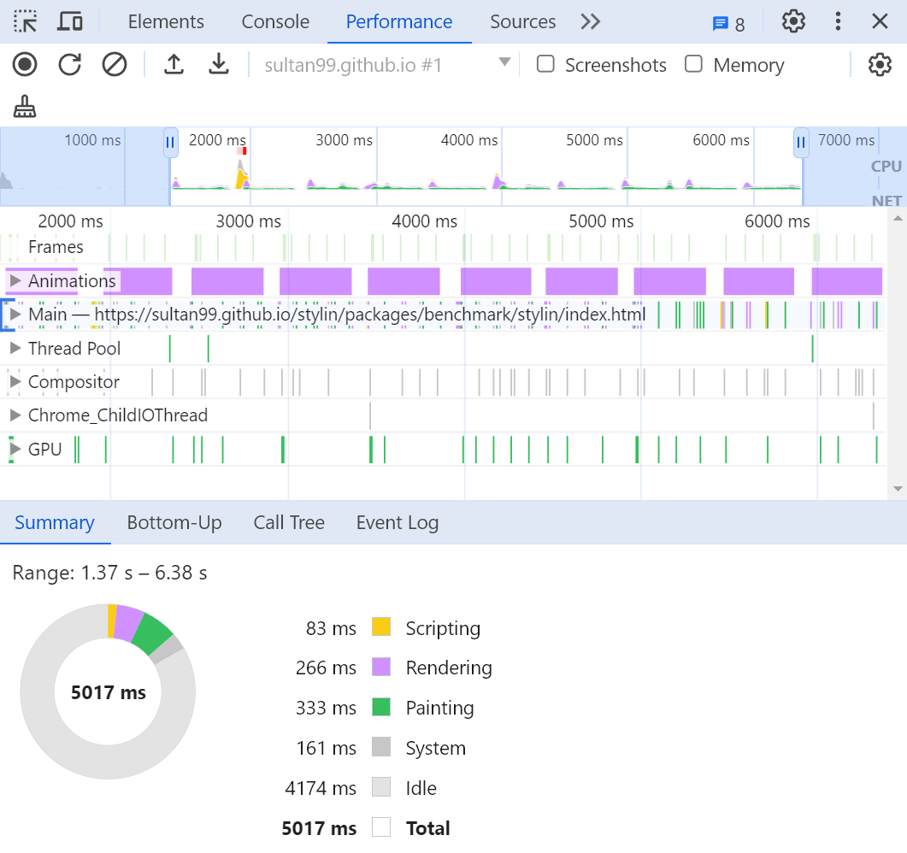
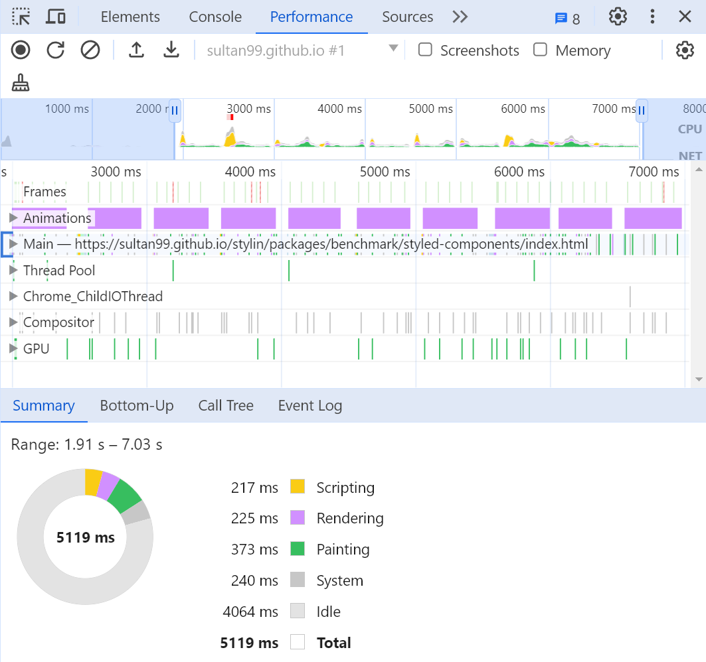

# Benchmarking Stylin vs. Styled Components
This repository hosts online demos of two projects that are identical in every aspect except for the styling library used. One project utilizes the Stylin library, while the other employs Styled Components. These demos are designed to showcase the performance differences between the two libraries in a controlled setting.

## Online Demos
 - [Stylin](https://sultan99.github.io/stylin/packages/benchmark/stylin/index.html) ([code source](https://github.com/sultan99/cards/tree/stylin))
 - [Styled components](https://sultan99.github.io/stylin/packages/benchmark/styled-components/index.html) ([code source](https://github.com/sultan99/cards/tree/styled-components))

During the online demo, clicking on the page will trigger a theme toggle action ten times consecutively.

## How to Perform the Benchmark
Follow these steps to benchmark memory usage and performance for both libraries:

1. Start the Demo: Open the demo link for either [Stylin](https://sultan99.github.io/stylin/packages/benchmark/stylin/index.html)
 or [Styled components](https://sultan99.github.io/stylin/packages/benchmark/styled-components/index.html).

2. Open Developer Tools: Use the shortcut `Ctrl + Shift + I` to open the developer tools in your browser.

3. Begin Recording: In the performance tab of the developer tools. Use the shortcut `Ctrl + E` start the recording process to capture the performance data.

4. Interact with the Page: Click on the page to initiate the theme toggle sequence. Avoid hovering over any interactive elements like cards during this process.

5. Stop Recording: Once the theme toggling has completed ten cycles, stop the recording in the developer tools.

6. Analyze Results: Review the recorded data to evaluate the memory usage and performance of the library in use.

## Test Results Analysis
The test results have been refined to focus on the essential metrics, particularly JavaScript (JS) Scripting, as it significantly impacts CPU consumption. A lower JS Scripting time indicates better performance due to reduced CPU usage.

### Key Findings:
- JS Scripting Performance: Stylin outperforms Styled Components in JS Scripting time, being 161.45% faster. This metric is crucial as it directly correlates with the efficiency and speed of the library.
- Overall Speed: When considering the total time across all phases, Stylin is 25.15% faster than Styled Components. This overall performance gain demonstrates Stylin's efficiency in handling tasks more swiftly.

### Detailed Breakdown:

#### Stylin Performance Metrics
| Phase      | Time  |
|------------|-------|
| Scripting  | 83 ms |
| Rendering  | 266 ms|
| Painting   | 333 ms|
| System     | 161 ms|
| **Total**  | **843 ms** |

#### Styled Components
| Phase      | Time   |
|------------|--------|
| Scripting  | 217 ms |
| Rendering  | 225 ms |
| Painting   | 373 ms |
| System     | 240 ms |
| **Total**  | **1055 ms** |

