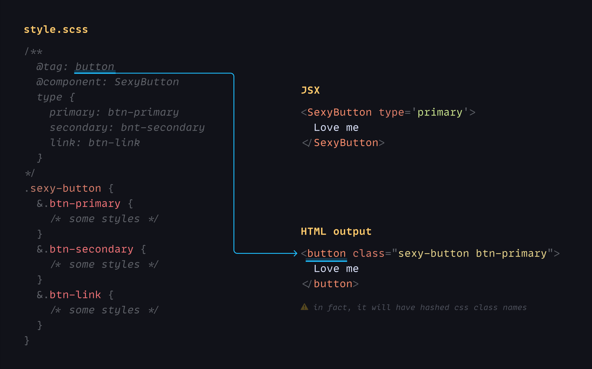

# @stylin/style

The core library. It is very tiny ([43 lines of code](./src/index.ts)) and well optimized for performance.
<br/>

## Installation

```sh
npm install --save @stylin/style
```
<br/>

## Mapping Style Annotations

Don't be scared to learn new stuff, it is deadly simple. Only three things to remember:
1) @tag: html tag
2) @component: name of your component
3) Mapping object:

```
componentPropertyName {
  propertyValue: css-class-name
  anotherPropertyValue: another-css
}
```

For example:
```scss
/**
  @tag: button
  @component: SexyButton
  type {
    primary: btn-primary
    secondary: bnt-secondary
    link: btn-link
  }
*/
.sexy-button {
  &.btn-primary { 
    /* some styles */
  }
  &.btn-secondary { 
    /* some styles */
  }
  &.btn-link { 
    /* some styles 
  */}
}
```

```jsx
<SexyButton type='primary'>
  Love me
</SexyButton>

/* HTML output:
<button class="sexy-button btn-primary"> //in fact, it will have hashed css class names
  Love me
</button>
*/
```


<br/>

## Shortening
If your component property values are similar to CSS class names, like in the example below:

```
type {
  primary: primary
  secondary: secondary
  link: link
}
```

It can be shorten this way:

```
type: primary | secondary | link
```

### More zen

```
/* conditional */
isVisible {
  true: visible
  false: hidden
}
/* short version */
isVisible: true ? visible : hidden

/* by the way it can be string or number */
checked: on ? blue : gray
checked: 1 ? blue : gray

/* single value */
isVisible {
  true: visible
}
/* short version */
isVisible: true visible

/* if value == css-name */
enabled {
  true: enabled
}
/* short version */
enabled: true
```
<br/>

## Variables
To map component variables with styles, you should provide the CSS variable and its default value. Webpack loader uses the default value to define the variable type and avoid reassigning it with the same value.

```
componentPropertyName: default-value --css-variable
```

```scss
/**
  @tag: button
  @component: SexyButton
  width: 150px --btn-width
*/
.sexy-button {
  --btn-width: 150px;
  width: var(--btn-width);
}
```

```jsx
<SexyButton width='180px'>
  Love me
</SexyButton>

/* HTML output:
<button style="--btn-width: 180px">
  Love me
</button>
*/
```
<br/>

### Caveat with CSS variables
You can't interpolate CSS variables with url(), it means you can't do this:

```
background-image: url(var(--src)); // will not work
```

Why? Read the answer [here](https://stackoverflow.com/questions/42330075/is-there-a-way-to-interpolate-css-variables-with-url). To fix this issue, you need to wrap the value with `url()` on JS side:

```scss
/**
  @tag: div
  @component: Avatar
  url: unset --src;
*/
.avatar {
  background-image: var(--src);
}
```

```jsx
import {url} from '@stylin/style'
const src = `https://picsum.photos/150`

<Avatar url={url(src)}/>
```
<br/>

### Restyling existing components
Let's assume we have a button component from 3rd party library, and we like to restyle it and add some extra property.
<br/>

```jsx
import {Button} from 'antd'
import {appleStyle} from './style.scss'

const StyledButton = appleStyle(`sexy-button`, Button)

<StyledButton type='dashed' isVisible>
  Love me
</StyledButton>
```

#### 💅 `style.scss`
```scss
/**
  @SexyButton
  isVisible: true ? btn-visible : bnt-hidden
*/
.sexy-button {
/*
  css styles which override or extend Antd Button styles
*/
}
```
<br/>

As the result, you will get a restyled button with additional `isVisible` property. All original button properties will be reserved.
<br/>

## ⚠ Important
Any restyling css class should have comment section: 

```scss
/**
*/
.ok-one {}

/**
  @AnyName
*/
.ok-two {}
```
<br/>

### Just `className`
Any component created with the Stylin library can be restyled again in the same way as mentioned above. Also, a new CSS class can be appended to className property without breaking existing styles.
<br/>

```jsx
import css from './style.scss'


<StyledButton className={css.special}>
  Love me
</StyledButton>
```

#### 💅 `style.scss`
```scss
.special {
  background-color: pink;
}
```
